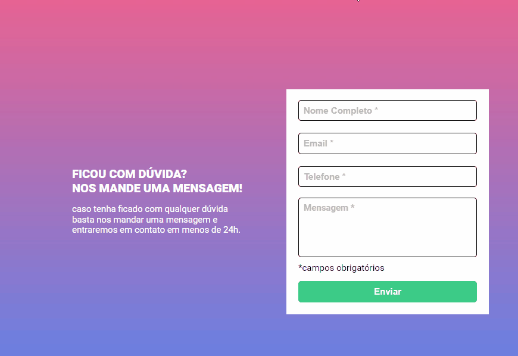

# Projeto JS intermediário do DEVQUEST



## Tecnologias utilizadas
<div style="display: inline_block"><br>


</div>

## Como utilizar

1 - Clone o projeto
```
git clone https://github.com/lucasem252/projeto-dev-quest-js-intermerdiario
```

2 - Acesse a página do projeto
```
cd  projeto-dev-quest-js-intermediario
```

## Autor

Lucas Eleuthério Mourão

## Agradecimentos

Segundo desafio DEVQUEST feito sozinho, foi muito desafiador começar a jornada da linguagem da programação com o Javascript, confesso que fiquei um pouco travado nesse projeto, revisei resumos, olhei códigos feitos e olhei dúvidas já tiradas na comunidade no discord que me ajudaram muito !!! Meu muito obrigado por todos ensinamentos passados até aqui e por todos da comunidade Devquest/Devemdobro !!
